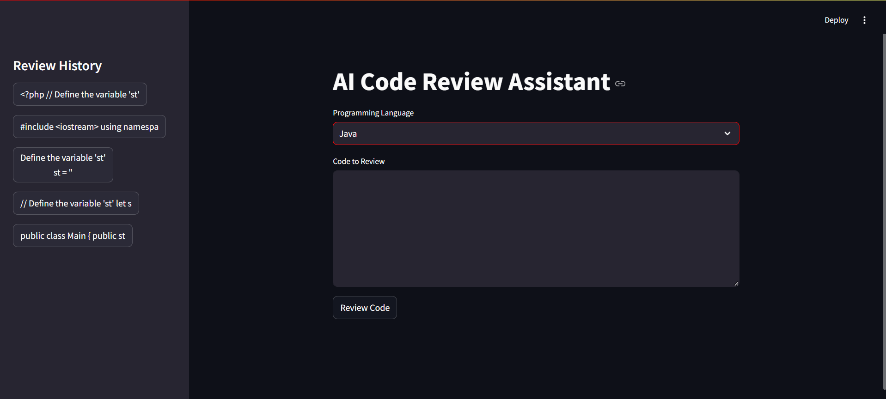

# AI-Code-Reviews-using-langchain-Ollama-and-Streamlit


# AI Code Reviewer

An AI-powered code reviewer supporting multiple programming languages, including:  
`Python`, `JavaScript`, `Ruby`, `Java`, `SQL`, `C++`, and `PHP`.  

Built using **LangChain**, **Ollama**, and **Streamlit**.

---

### Project Structure:
- **`ai.py`**: Handles AI functions.  
- **`database.py`**: Manages database functions.  
- **`config.py`**: Stores configuration variables.  
- **`app.py`**: Manages the UI using Streamlit.  
- **`review.py`**: Contains the code review schema.

---

### Installation:
1. Install required libraries:
   ```bash
   pip install mlflow streamlit peewee langchain-community langchain-ollama
   pip freeze > requirements.txt

## Tools Overview

- **LangChain**: Uses LlamaIndex for AI functionalities.  
- **LLM**: Supports Ollama (local) or OpenAI as the language model.  
- **Application Frameworks**: Flask, FastAPI, Streamlit.  
- **Tracking**: MLflow, GitHub Actions.  
- **Database ORM**: Peewee, SQLAlchemy.  

---

## Run

To start the application and MLflow UI, execute the following command:

```bash
python -m streamlit run app.py && mlflow ui

